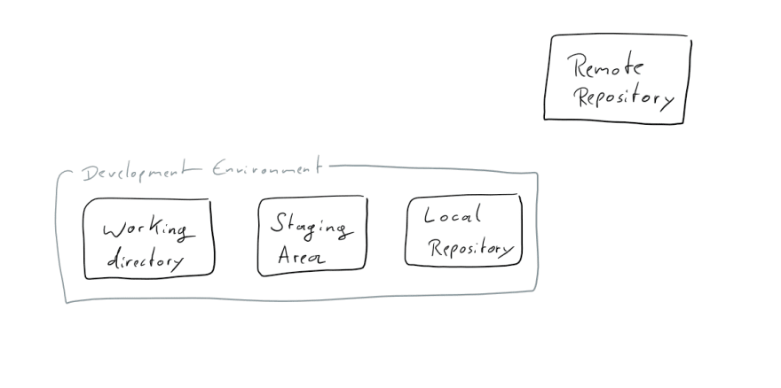

# Github & Git 101

## What will I learn during this session?
This session provides basic knowledge of Git and Github. After 90 minutes, you will contribute to a codebase and help build our very own website. You will also learn how to approve code changes from other developers.  :sparkles:

### Git
Git is a distributed version-control system for tracking changes in source code during software development. It is designed for coordinating work among programmers, but it can be used to track changes in any set of files. Its goals include speed, data integrity, and support for distributed, non-linear workflows




### Github :octocat:
If you are reading this, you are probably on Github.com. Github.com enables teams to collaborate on the same code base.

## Who uses Git and Github?
All major software companies use Git to build software. Google, Facebook, Amazon, Microsoft, Netflix, Airbnb, and any startup you could think of.

## Requirements
* Github account. Sign up at http://github.com
* Download VS Code from https://code.visualstudio.com/download (Code Editor)

## Getting started

Run the following command from your terminal window. This will clone this project on your local computer.

```
git clone https://github.com/hacker-hang/github101.git
```

```
cd github101
```

#### First time only:
From the terminal:
```
git config user.email "<EMAIL YOU SIGNED UP ON GITHUB>"
git config user.name "<YOUR NAME>"
```

#### First time only:
```
git status (Check the status of your work)
git branch (What branch are you on?)
git checkout -b <branch name> (Create a new branch)
git add <file name> (State a file to be commited)
git commit -m <describe your change> (Commit your changes and give it a description)
git push (Push your code to your online repository (Github))
git pull (Pull the latest code from the online corresponding branch)
```

### Our work
All of our work will be visible via the following link:

https://hi.hackerhang.com

### References

<https://education.github.com/git-cheat-sheet-education.pdf>

<https://lab.github.com/githubtraining/>

<https://dev.to/unseenwizzard/learn-git-concepts-not-commands-4gjc>

